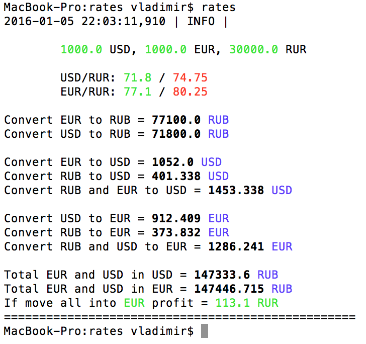

Tinkoff-Bank debit card rates and suggestions script

Workflow with the current [config](config.yaml):

### Description

Скрипт работает с официальными курсами валют для дебетовых карт Тинькофф-банка, предлагает варианты арбитража. 

Лучше всего использовать в паре с https://tinkoffrates.ru

## How to

### Setup, A - global

1) Install dependencies: `pip install -r requirements.txt`

2) Create the Alias to reach fast response in .bash_profile (OSX): type `nano ~/.bash_profile` and add `alias rates="cd path/to/rates/folder/ && python main.py"` where you must replace path/to/rates/folder/ with the real path.

### Setup, B - localized (recommended)

1) Create virtual environment in project folder: `virtualenv venv`

2) Install dependencies: `venv/bin/pip install -r requirements.txt`
 
3) Create the Alias to reach fast response in .bash_profile (OSX): type `nano ~/.bash_profile` and add `alias rates="cd path/to/rates/folder/ && python main.py"` where you must replace path/to/rates/folder/ with the real path.

E.g. on my machine the command is: `alias rates="cd /Users/vladimir/Desktop/rates && venv/bin/python main.py"` and I launch this only by typing `rates`.

### Usage 

Edit the [config.yaml](config.yaml) file with your money amount and just run the script.

------

Copyright 2016 Vladimir Kasatkin
